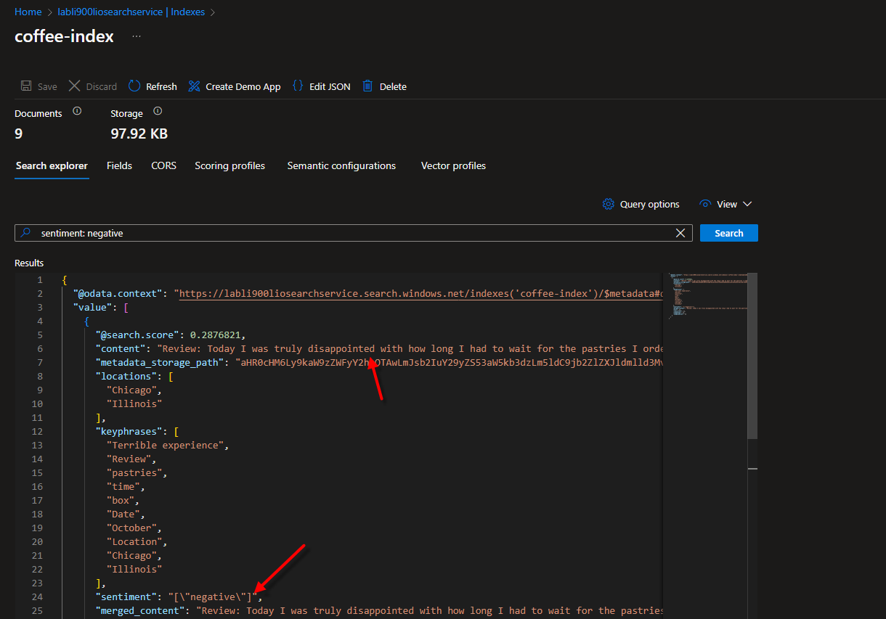
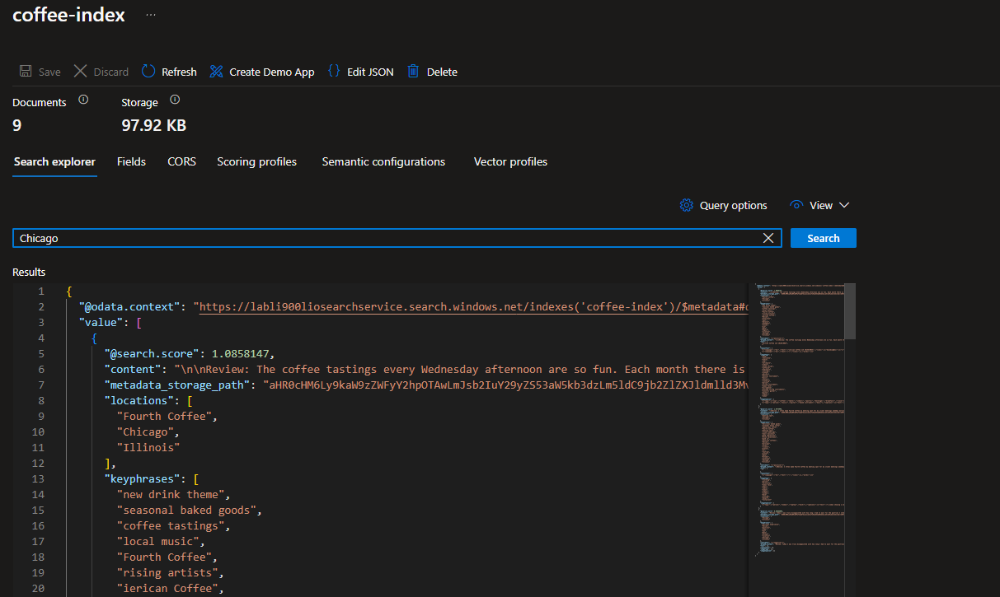

# 
AzureI900_Search

Ao explorar a documentação, fica evidente que o AzureI900_Search é uma ferramenta robusta para gerenciamento de dados. Permite a inserção eficiente de dados em um container no Azure Storage Account. Após a criação de um recurso de IA, torna-se possível realizar pesquisas em trechos de documentos de maneira eficaz, facilitando a administração e consulta de dados, independentemente do volume.

Abaixo estão alguns resultados de testes de pesquisa em documentos, conforme descrito na documentação:

- A IA, por meio da análise de textos e sentimentos, demonstrou sua capacidade ao classificar o banco de dados de opiniões dos clientes, destacando especificamente aquelas identificadas como negativas.
  

  - Além disso, é possível filtrar as opiniões dos clientes com base em sua localidade, proporcionando uma visão específica.
  